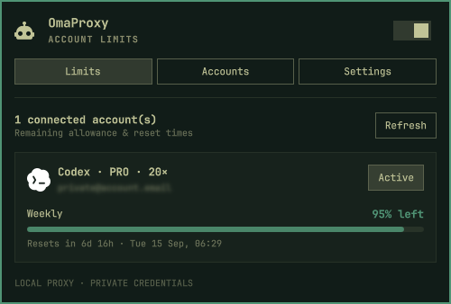
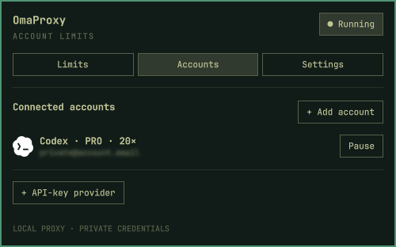

<div align="center">

# OmaProxy

**Your AI account limits, right in the Omarchy bar.**

A native Quickshell plugin for quotas, accounts, and your local AI proxy.

[](LICENSE)
[](https://omarchy.org)

[Install](#install) · [Features](#three-tabs-one-place) · [Providers](#provider-support) · [Configuration](docs/configuration.md) · [Contributing](CONTRIBUTING.md)



</div>

## Three tabs, one place

| Limits | Accounts | Settings |
| :--- | :--- | :--- |
| Remaining allowance and reset countdowns | Browser sign-in with native progress | Startup, restart, and inline logs |
| Weekly view by default | Provider icons and Pro 5× / 20× labels | Optional model-specific limits |
| Pause or resume any account | Multiple accounts and API-key providers | Routing, models, and connection details |

- **Fits your desktop.** Uses Omarchy's colors, typography, and popup components.
- **Useful at a glance.** The main weekly limit stays visible; extra windows are one setting away.
- **No terminal popups.** Setup, device codes, callback entry, and logs stay in the plugin. Only provider sign-in opens your browser.
- **Ready for screenshots.** Emails are softly blurred by default. Click to reveal, click again to hide; closing the popup conceals them automatically. Inline logs redact email addresses.
- **Honest quota states.** Unknown is not zero. A failed refresh preserves the last reading with a stale-data warning.
- **Independent service.** The proxy keeps running when the desktop shell reloads.

<details>
<summary><strong>See account management</strong></summary>
<br>

</details>

## Install

Requires **Omarchy with its Quickshell plugin system**, Python 3, Qt's Graphical Effects compatibility module, systemd user services, `wl-copy`, and `xdg-open`. Older Waybar-based Omarchy is not supported.

```bash
omarchy plugin add https://github.com/soojy/omaproxy --enable
```

1. Open **OmaProxy** from the robot icon in your bar.
2. Choose **Set up proxy**. The plugin downloads a pinned CLIProxyAPI release, verifies its SHA-256 against architecture-specific digests pinned in this plugin, and creates a user service.
3. Start the proxy, then select **Accounts → Add account** and finish the provider's browser sign-in.
4. Open **Limits** to see your remaining allowance.

Omarchy installs the plugin files only. Backend setup is a separate, explicit action in the popup and does not require root.

### Connect a coding tool

In **Settings**, copy the endpoint and API key into your tool's OpenAI-compatible provider configuration. The default endpoint is:

```text
http://127.0.0.1:8317/v1
```

Choose a model from **Settings → Show models**. Provider OAuth tokens stay with the backend; the generated local API key authenticates your tool to the proxy.

## Provider support

| Provider | Native account sign-in¹ | Quota display |
| :--- | :---: | :--- |
| Codex | ✓ | Plan tier, weekly and additional windows |
| Claude | ✓ | Session, weekly, and model windows |
| Kimi | ✓ | Reported usage windows |
| Antigravity | ✓ | Model-group quotas; requires a project ID |
| xAI | ✓ | Not yet supported |
| OpenAI-compatible API endpoints | API-key form | Not yet supported |

¹ The installer pins **CLIProxyAPI v7.2.154**. Gemini, Qwen, and GitHub Copilot require a compatible backend; unsupported login options are hidden. Provider capabilities and quota endpoints can change.

Codex's `prolite` plan is displayed as **PRO · 5×** and `pro` as **PRO · 20×**. These labels describe plan tiers, not remaining tokens or temporary promotions. Monthly-only plans show their overall monthly allowance instead of an invented weekly window.

Quota checks refresh once a minute while the popup is open. Manual Refresh bypasses the cache. Requests use backend token substitution, with bounded concurrency and a lock to avoid duplicate automatic checks from multiple monitors.

### Bring your own backend

To connect to an existing server, open **Settings → Connection → Remote**.
Enter its base URL (without `/v1`), management key, and optionally a client API
key for model discovery, then choose **Test and save connection**. No local
CLIProxyAPI installation is required. Accounts and quotas use the management
key; provider OAuth credentials remain on the server.

Use HTTPS, or loopback HTTP through an existing SSH tunnel. Remote mode shows
connection health instead of local service controls. Add new accounts through
**Manage accounts**, which opens the server's management panel. See
[remote configuration](docs/configuration.md#remote-connections) for details.

For a custom **local executable**:

```bash
python3 ~/.config/omarchy/plugins/soojy.omaproxy/scripts/omaproxy.py setup \
  --binary /absolute/path/to/cli-proxy-api-plus
```

OmaProxy creates its own configuration and credentials; it does not adopt another proxy's process or tokens. Use `--port 18317` on initial setup if 8317 is occupied. Re-running setup preserves existing settings; restart the proxy after replacing an active backend.

## Privacy and local storage

Email labels use a real blur effect over a fixed placeholder, so screenshots contain neither the address nor its original length. Click an email to reveal it, or focus it and press Enter/Space. Closing the popup hides every revealed address again. Inline logs always redact email addresses. This is display privacy, not encryption or a change to the account itself.

Credentials and generated keys live outside the plugin checkout, under `~/.config/omaproxy/`. The proxy binds to loopback, requires a client key, and disables remote management. Copy API key intentionally puts a secret on the clipboard; a clipboard manager may retain it.

See [configuration and file locations](docs/configuration.md) and the [security notes](SECURITY.md).

## Update or remove

```bash
# Update the plugin
omarchy plugin update soojy.omaproxy

# Remove the integration, preserving credentials
systemctl --user disable --now omaproxy.service
omarchy plugin remove soojy.omaproxy
rm -f ~/.config/systemd/user/omaproxy.service
systemctl --user daemon-reload
```

The backend version and archive digests are pinned in the plugin and are not silently updated by plugin updates. See the [installer trust policy](docs/installer-security.md) for the reviewed digests and download/extraction limits. Stored credentials remain in `~/.config/omaproxy/` after removal. XDG overrides are supported; adjust the paths if you use them.

## Development

```bash
python3 -m unittest discover -s tests -v
node tests/limit-model.test.cjs
omarchy plugin validate .
/usr/lib/qt6/bin/qmlformat --normalize BarWidget.qml >/dev/null
bash scripts/install-plugin.sh
```

To run the real-backend integration tests as well:

```bash
OMAPROXY_TEST_BINARY="$HOME/.local/share/omaproxy/cli-proxy-api" \
  python3 -m unittest discover -s tests -v
```

Integration tests use a separate proxy on an ephemeral loopback port and a mock upstream. They do not use your accounts or send prompts to an AI provider. For structural QML edits, `omarchy restart shell` clears cached components; the proxy service survives the restart.

[Contributing](CONTRIBUTING.md) · [Architecture](docs/architecture.md) · [Report a bug](https://github.com/soojy/omaproxy/issues/new?template=bug_report.md)

## Credits

Inspired by [VibeProxy](https://github.com/automazeio/vibeproxy), powered by [CLIProxyAPI](https://github.com/router-for-me/CLIProxyAPI), and built on [Omarchy](https://omarchy.org) and [Quickshell](https://quickshell.org).

Codex and Claude marks reuse Omarchy's built-in assets. Other provider marks come from [Lobe Icons](https://github.com/lobehub/lobe-icons); their [MIT license](assets/LICENSE.lobe-icons) is included. Logos belong to their respective owners.

OmaProxy is an independent Linux frontend, not a Swift binary port. VibeProxy's extra ThinkingProxy relay, Vercel Gateway routing, public tunnels, and Sparkle updater are not included.

[MIT License](LICENSE)
